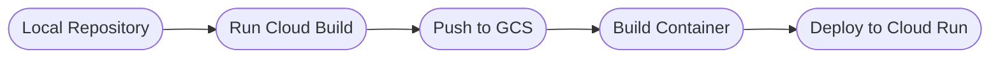

# EcoSense Web Application

## Introduction
EcoSense Web Application is an application for managing campaigns and users.\
This is a [Next.js](https://nextjs.org/) project bootstrapped with [`create-next-app`](https://github.com/vercel/next.js/tree/canary/packages/create-next-app).

## Technologies

## Dependencies

### Production

### Development

[Go to List of Dependencies](https://github.com/EcoSenseID/EcoSense-Webapp/network/dependencies)

## Try the App
Visit our deployed web application through:
- `Legacy (07-06-2022)` - Vercel ([https://ecosense.vercel.app](https://ecosense.vercel.app))
- `Latest (11-06-2022)` - Google Cloud Run ([https://ecosense-web-of7z476jgq-as.a.run.app/](https://ecosense-web-of7z476jgq-as.a.run.app/))

## Infrastructure
- Artifact Registry (Docker) `cloud-run-source-deploy/ecosense-web`
- Cloud Build `53da3034` (latest - June 11, 2022 10:35 GMT+7)
- Google Cloud Storage `ecosense-bangkit_cloudbuild/source`
- Cloud Run `ecosense-web`
  - Revision `ecosense-web-00008-zif` (100% traffic) 
  - Autoscaling - max instances `100`

## Screenshot
`Dark mode disabled`

`Dark mode enabled`

## 
&#169; EcoSense 2022.